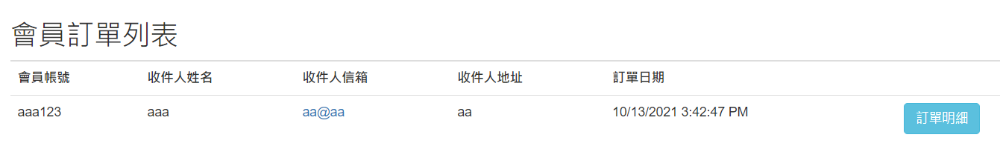

# [專案功能說明]
使用ASP.NET MVC建立簡易電商網站：包含會員機制、產品列表、購物車增/刪/查詢、訂單查詢等功能。 
[網站部署於Azure](https://demoservice.azurewebsites.net/)
1. 使用Session判斷會員是否登入。
2. 使用資料庫正規畫設計資料表使用MSSQL。使用 ADO.NET 並通過Store Procedure進行資料庫存取。
3. 專案架構使用Repository Pattern將資料庫串接層分離。

# [專案架構]
**系統架構** 

**未登入時功能架構** 

**登入時功能架構**  

# [網站首頁介面]

